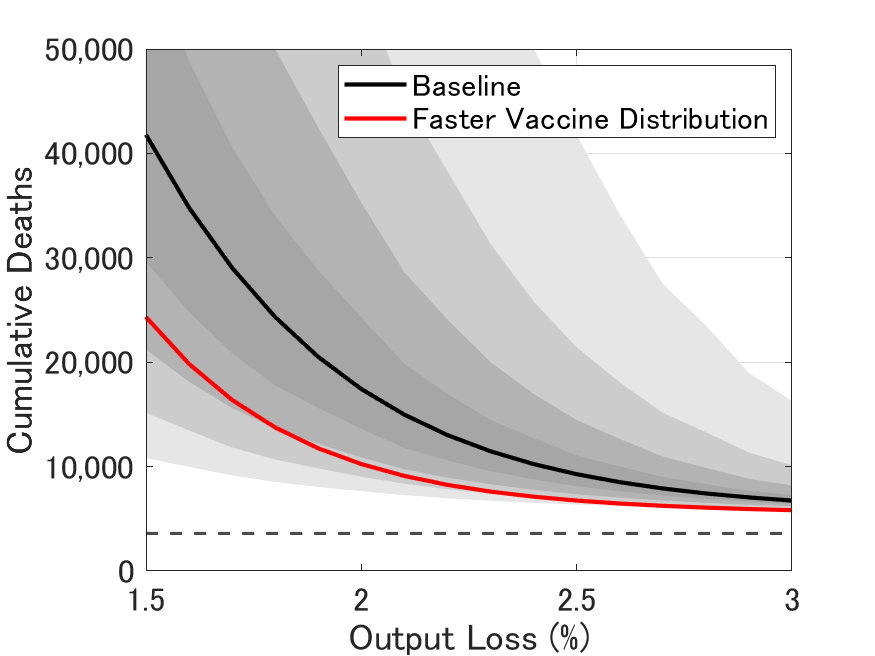

## 最終アップデート：2021年1月21日

図表の作成に用いたコードやデータファイルは[ここ](https://github.com/Covid19OutputJapan/Covid19OutputJapan.github.io/tree/main/_archives/).

### 1. Covid-19の感染状況の条件付き予測

{: align="center"}
||

出所: 著者達の計算による。  
注1: "New infections": 1週間の新規感染者数. "Output (deviation from reference level)": 総生産量（参照レベルからの乖離）. "Effective reproduction number": 実効再生産数. "Newly vaccinated persons": 1週間の新規免疫獲得者.  
注2: 　赤線: 1年平均総生産量ロスが1.5%. 黒線: 1年平均総生産量ロスが2%.青線: 1年平均総生産量ロスが3%.

### 2. Covid-19とGDPの予測される関係

{: align="center"}
||

出所: 著者達の計算による。 
注1: 縦軸は12か月後までに予測されるコロナ感染による総死亡者数、横軸はこれから12か月間の総生産量のリファレンスからの平均乖離。上のパネルでは、最も濃い、次に濃いグレイのエリアはそれぞれ20パーセント、40パーセントの信頼区間を示す。また、最も薄い、次に薄いグレイのエリアはそれぞれ80パーセント、60パーセントの信頼区間を示す。 
注2: 黒線: 直近の週.　赤線: 1週間前. 青線: 2週間前.

### 3. 条件付き予測における誤差

#### 新規陽性者数

{: align="center"}
||

#### 新規死亡者数

{: align="center"}
||

#### i. 1週間予測

{: align="center"}
|    | 1週前の 条件付き予測値 | 実現値 | 条件付き 予測誤差 |
| ---- | ---- | ---- | ---- |
| **新規陽性者数** |  53,088  | 41,290   | 11,798 |
| **新規死亡者数** |  723 |  445   | 278 |

#### ii. 4週間予測

{: align="center"}
|    | 4週前の 条件付き予測値 | 実現値 | 条件付き 予測誤差 |
| ---- | ---- | ---- | ---- |
| **新規陽性者数** |  83,138  |  129,454  | -46,315 |
| **新規死亡者数** |   1,004 | 1,459      | -454 |

出所: 著者達の計算による。

### 5. 今週のチャート

{: align="center"}
||

Source: 著者達の計算による。
Note: 黒実線と灰色のファンチャートは図２と同じ。 赤実線はワクチン接種速度が基本シナリオの2倍の場合。
