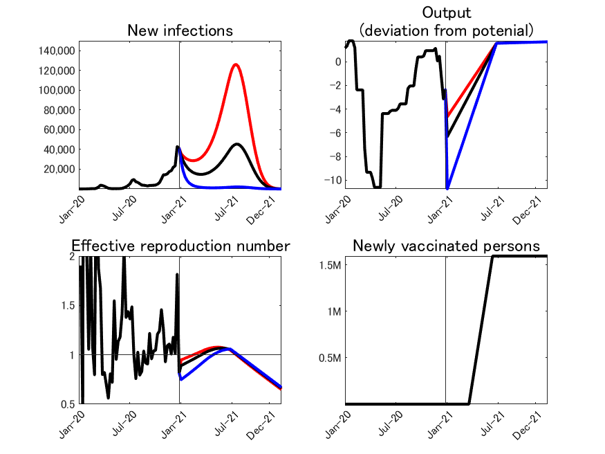
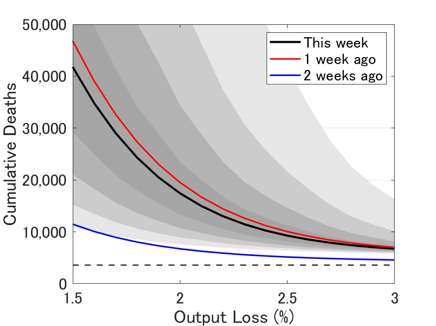
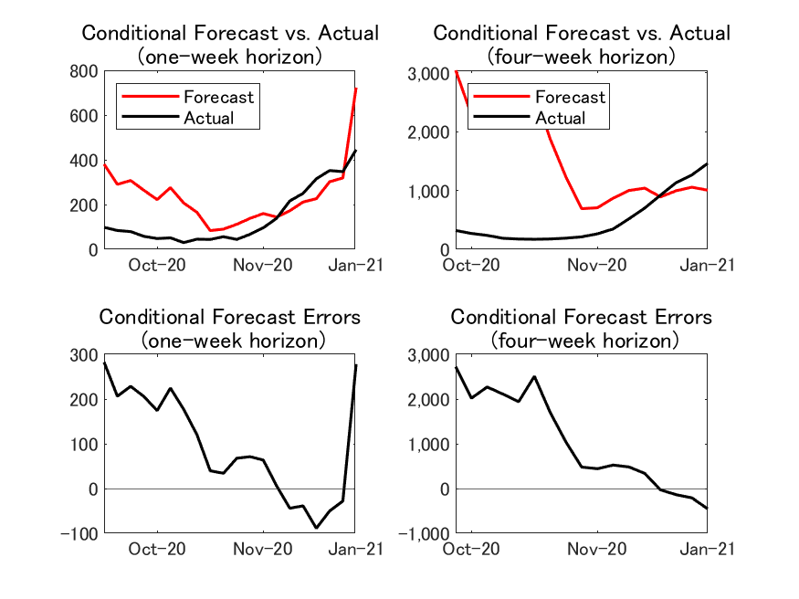
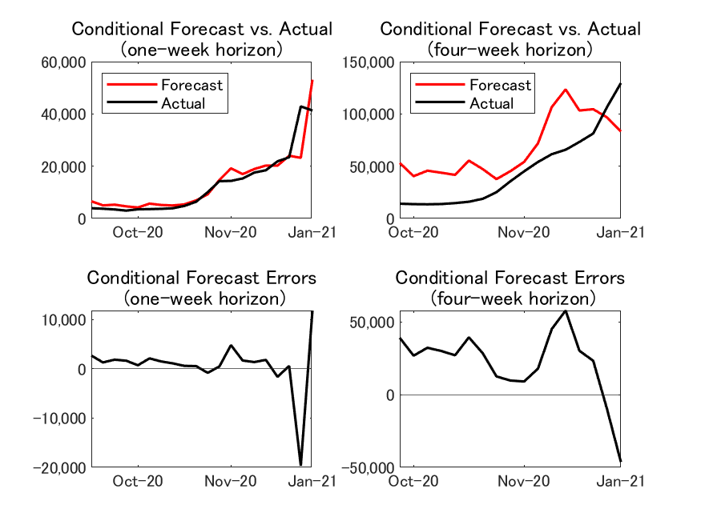

## 最終アップデート：2021年1月21日

図表の作成に用いたコードやデータファイルは[ここ](https://github.com/Covid19OutputJapan/Covid19OutputJapan.github.io/tree/main/_archives/).

### 1. Covid-19の感染状況の条件付き予測

{: align="center"}
||

出所: 著者達の計算による。

### 2. Covid-19とGDPの予測される関係

{: align="center"}
||

出所: 著者達の計算による。  注: 縦軸は12か月後までに予測される総死亡者数、横軸はこれから12か月間の総生産量のリファレンスからの乖離。上のパネルでは、最も濃い、次に濃いグレイのエリアはそれぞれ総死者数の20パーセント、40パーセントの信頼区間を示す。また、最も薄い、次に薄いグレイのエリアはそれぞれ総死者数の80パーセント、60パーセントの信頼区間を示す。

### 3. 条件付き予測における誤差

#### 新規死亡者数

{: align="center"}
||

#### 新規陽性者数

{: align="center"}
||

#### i. 1週先予測

{: align="center"}
|    | 実現値 | 1週前の 条件付き予測値 | 条件付き 予測誤差 |
| ---- | ---- | ---- | ---- |
| **新規陽性者数** |  41,290  |  53,088  | 11,7983 |
| **新規死亡者数** |  445  |  723  | 278 |

テスト

#### ii. 4週先予測

{: align="center"}
|    | 実現値 | 4週前の 条件付き予測値 | 条件付き 予測誤差 |
| ---- | ---- | ---- | ---- |
| **新規陽性者数** |  129,454  |  83,138  | -46,315 |
| **新規死亡者数** |   1,459  |    1.004  | - 454 |

出所: 著者達の計算による。
