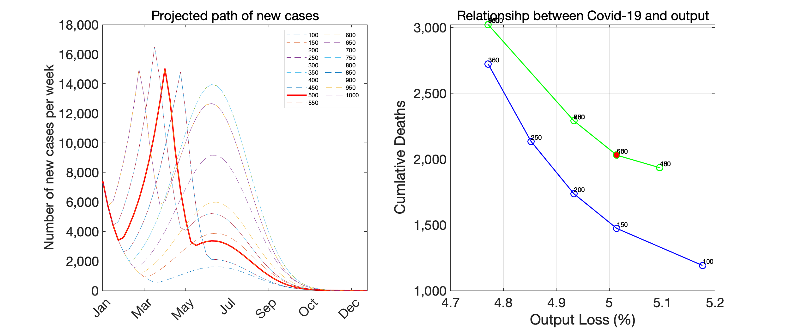
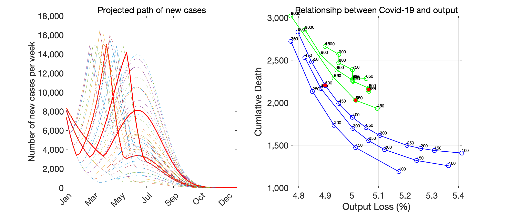

## 最終アップデート：2021年1月21日

図表の作成に用いたコードやデータファイルは[ここ](https://github.com/Covid19OutputJapan/Covid19OutputJapan.github.io/tree/main/_archives/).

### 1. 基本シナリオ

{: align="center"}
||

出所: 著者達の計算による。  
注: 左のパネルは、基本シナリオ下での新規感染者数の推移。赤い実線は緊急事態宣言解除基準が500人だった場合、その他の細い点線は解除基準人数を変更した場合。右のパネルは、それぞれの解除基準人数によってどのように今後6ヶ月の総死者数と総生産量が影響を受けるかを示す。シナリオの詳細についてはFujii and Nakata (2021)を参照。

### 2. 早期感染収束シナリオ

{: align="center"}
||

出所: 著者達の計算による。 
注: 左のパネルは、早期感染収束シナリオ下での新規感染者数の推移。赤い実線は緊急事態宣言解除基準が500人だった場合、その他の細い点線は解除基準人数を変更した場合。右のパネルは、それぞれの解除基準人数によってどのように今後6ヶ月の総死者数と総生産量が影響を受けるかを示す。シナリオの詳細についてはFujii and Nakata (2021)を参照。

### 3. 感染収束長期化シナリオ

{: align="center"}
||

出所: 著者達の計算による。 
注: 左のパネルは、感染収束長期化シナリオ下での新規感染者数の推移。赤い実線は緊急事態宣言解除基準が500人だった場合、その他の細い点線は解除基準人数を変更した場合。右のパネルは、それぞれの解除基準人数によってどのように今後6ヶ月の総死者数と総生産量が影響を受けるかを示す。シナリオの詳細についてはFujii and Nakata (2021)を参照。

### 4. 3つのシナリオ同時に

{: align="center"}
||

出所: 著者達の計算による。 
注: 左パネル・右パネル両者とも、上の3つの図で見せているものを一つにまとめたもの。

